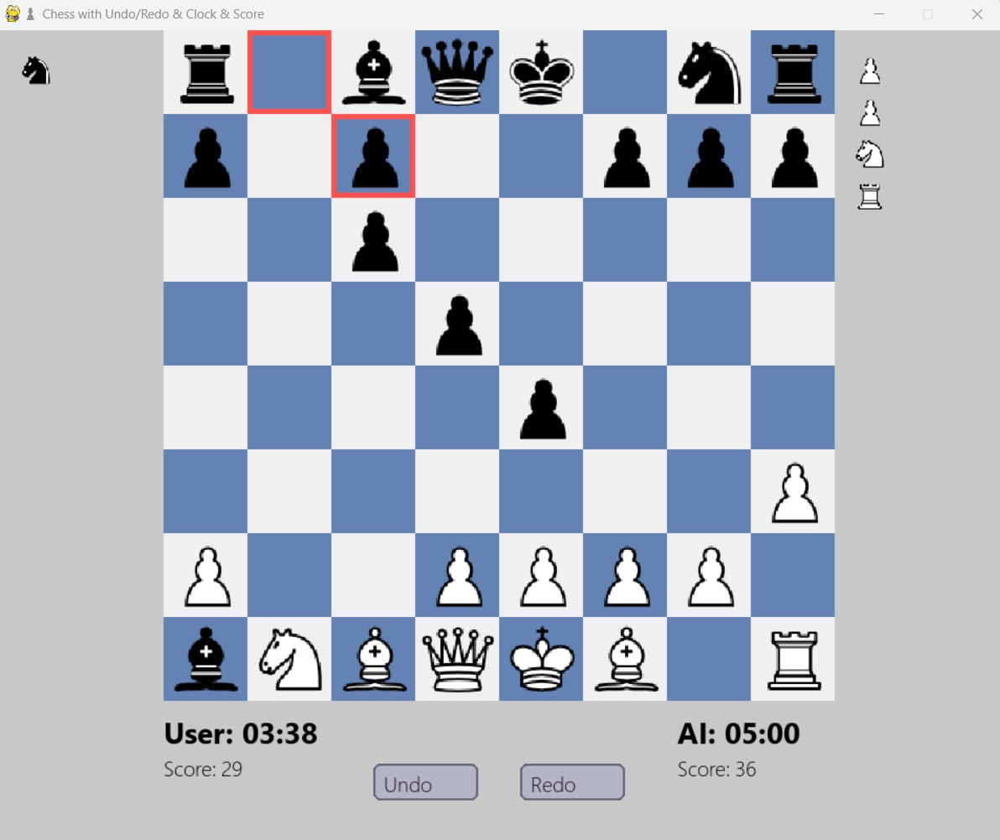

# ChessMate
A Python chess game with AI opponent using Stockfish, featuring real-time clocks, captured piece tracking, move animations, score calculation, and undo/redo functionality, built with Pygame.
# ♟ Chess Game with AI, Undo/Redo, Clock & Score

A **Python Chess Game** built using **Pygame** and **python-chess**, featuring an AI opponent powered by Stockfish, move animations, captured piece tracking, real-time chess clocks, and undo/redo functionality.

---

## 🎮 Features

- Play as **White or Black**  
- **AI Opponent** powered by **Stockfish**  
- **Undo / Redo** moves  
- **Captured Pieces** displayed on both sides of the board  
- **Real-time Chess Clocks** for player and AI  
- **Score Tracking** based on captured pieces  
- **Smooth Piece Movement Animations**  
- User-friendly **GUI** layout resembling modern chess apps  

---

## 🖥️ Screenshot

  
*(Add a screenshot named `screenshot.png` in your repo)*

---

## ⚙️ Installation

1. Clone the repository:

```bash
git clone <your-repo-url>
cd <your-repo-folder>
